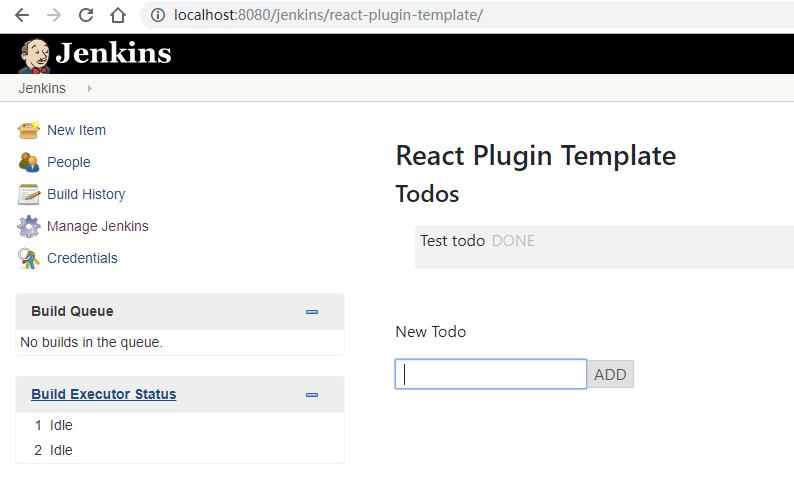

#  React Plugin Template

This is a template project which builds Jenkins plugin UI with React.

## Overview

Developing plugin for Jenkins has always been an easy way to do with its Jelly based UI render system, but Jelly seems to be pretty heavy when we need to use some more modern tools like React and if we need to make the plugin UI much customized, this is what this template is built for.

This template is part of the project [Working Hours UI Improvement](https://summerofcode.withgoogle.com/projects/#6112735123734528) during
[Google Summer of Code 2019](https://summerofcode.withgoogle.com/), which improve the UI of Working Hours Plugin using this pattern to develop Jenkins plugin with React. The main repository could be found at [Working Hours Plugin](https://github.com/jenkinsci/working-hours-plugin).

## Features

| Feature               | Summary                                                                                                                                                                                  |
| --------------------- | ---------------------------------------------------------------------------------------------------------------------------------------------------------------------------------------- |
| React Integrated      | React is integrated, your can take full control of the UI                                                                                                                                |
| Using Iframe          | Using iframe could create a new javascript env, we can get rid of some side effects of some polyfills which was added globally.(such as Prototype.js)                                    |
| Maven Lifecycle       | npm commands are integrated into Maven lifecycle with help of [Frontend Maven Plugin](https://github.com/eirslett/frontend-maven-plugin/)                                                |
| Webpack               | Webpack helps us reduce the size of the bundle, also avoids pollution on the global namespace.                                                                                           |
| Free to make requests | Crumb is attached to Axios client, now you can send requests in the way you used to do in React                                                                                          |
| Express as devserver  | You can run your react app in a standalone page so you can develop in webpack hot reload mode, also with webpack proxy, the standalone app is still accessible to the jenkins dev server |
| Axios as http client  | Axios hugely simplify the way to make requests.|

## Screenshots

Example Plugin UI


Management Link


## Getting Started

Clone the repo:
```sh
git clone https://github.com/jenkinsci/react-plugin-template.git
cd react-plugin-template
```
Install the Maven dependencies and node modules.
```sh
mvn install -DskipTests
```

Run standalone React app with hot reload
```sh
npm run start
```
Run plugin
```sh
mvn hpi:run -Dskip.npm -f pom.xml
```

## Send HTTP requests

As Crumb Issuer is default enabled in Jenkins and each ajax request is required to contain a `Jenkins Crumb` in request header, so be sure to use the `axiosInstance` which is already set up with `Jenkins Crumb` and exported at `src/main/react/app/api.js`.
```javascript
export const apiGetData = () => {
  return axiosInstance.post("/data");
};
```
Or if you want to use your own http client, remember to add the `Jenkins Crumb` to your request's header, the Crumb's key and content could be found at `src/main/react/app/utils/urlConfig.js`, then you can set the header like below.

```javascript
const headers = {};
const crumbHeaderName = UrlConfig.getCrumbHeaderName();

if (crumbHeaderName) {
  headers[crumbHeaderName] = UrlConfig.getCrumbToken();
}
```

## Write your own request handler

Now you can customize your request pattern as you want, also we need to write a handler.

Jenkins is using stapler to preprocess the requests, so if you need a request handler. For example and also in this template, you can use an `Action` class to create a sub-url, and then a [StaplerProxy](http://stapler.kohsuke.org/reference.html) to proxy the request like a router. More info about a handler can be found here [Stapler Reference](http://stapler.kohsuke.org/reference.html).

### Example handler

ManagementLink would get the request and then handle it to the `PluginUI`
```java
@Extension
public class PluginManagementLink extends ManagementLink implements StaplerProxy {

    PluginUI webapp;

    public Object getTarget() {
        return webapp;
    }

    public String getUrlName() {
        return "react-plugin-template";
    }
}
```
`PluginUI`, stapler would then find methods in the target class, in this case, it finds `doDynamic`, then we can choose the next handler by return the methods result, in this case, `getTodos` or `setTodos`, and `PluginUI` just function like a url router.
```java
public class PluginUI{
    public HttpResponse doDynamic(StaplerRequest request) {
        ...

        List<String> params = getRequestParams(request);

        switch (params.get(0)) {
        case "get-todos":
            return getTodos();
        case "set-todos":
            return setTodos(request);
        }
        ...
    }
}
```

## Data Persistence

You can save your data with a descriptor
```java
@Extension
public class PluginConfig extends Descriptor<PluginConfig> implements Describable<PluginConfig>
```
And after each time you change data, call `save()` to persist them.
```java
    public void setTodos(
            @CheckForNull List<Todo> value) {
        this.todos = value;
        save();
    }
```

And in your handler, you can get the config class by calling
```java
config = ExtensionList.lookup(PluginConfig.class).get(0);
```


## Customize your plugin

### Be sure to modify all the occurrence of `react-plugin-template`

- At `org/jenkinsci/plugins/reactplugintemplate/PluginUI/index.jelly` , change the iframe's id and its source url.
- At `src/main/react/app/utils/urlConfig.js` change 
- At `src/main/react/server/config.js` , change the proxy route.
- At `src/main/react/package.json` , change the start script's BASE_URL
- At `pom.xml` , change the artifactId
- At `org/jenkinsci/plugins/reactplugintemplate/PluginManagementLink.java` , change names.

Also use the `same value` to modify the occurrence in `src\main\react\app\utils\urlConfig.js`.

### Customize a page for your plugin

Management Link is recommended, which would get your plugin a standalone page, along with a entry button in the `/manage` system manage page.


## How does this template function?

In short, this template is like putting a webpack project inside a Maven project, and this template is just chaining the build result by copy the webpack output to the plugin's webapp folder to make it accessible from the iframe, then Jelly render the iframe and the client gets the Plugin UI.

## Why iframe?

Because jenkins has last a long time, from when JSP or Jelly is widely used to render web pages, added lots of polyfills, like Prototype.js is provided to give extensions to javascript. But it is added to the global namespace, if we simply mount our React app to a point, it'll be disturbed. While iframe is using a new environment from the browser, the interference can be avoided. 
